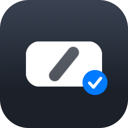
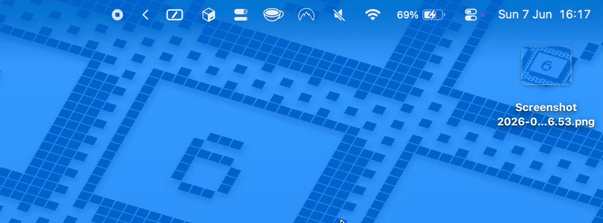

# Slashgrab

<p align="center">
  
</p>


Slashgrab is a tiny macOS menu bar utility that turns dropped files and folders into copied path text.

Drop something on the menu bar icon, then paste the path wherever you need it.



## Why

I built Slashgrab because getting a file path was always more work than it should be.

When I needed to paste a path into an AI agent, a chat, a terminal command, a bug report, or a config file, I usually had to find the file in Finder, drag the folder into Terminal or use another copy-path flow, copy the result, then switch back to the app where I actually needed it.

Slashgrab removes that detour:

1. Drag a file or folder.
2. Drop it on the Slashgrab menu bar icon.
3. Paste the copied path.

No command palette, no Finder service, no temporary shelf, no extra window to manage.

## Features

- **Menu bar drop target**: drop files or folders directly on the Slashgrab icon.
- **Instant clipboard copy**: the formatted path is copied as soon as the drop succeeds.
- **Multiple path formats**:
  - Shell Escaped
  - Path
  - Quoted Path
  - File URL
  - Home-relative Path
- **Multi-item support**: drop more than one item and Slashgrab formats the full set for the selected output style.
- **Recent paths**: reopen the menu to copy recently grabbed paths again.
- **Drop feedback**: quick visual confirmation when a path was copied.
- **Launch at login**: keep Slashgrab ready without starting it manually.
- **Sparkle updates**: release builds include update checking support.

## How It Works

Slashgrab lives in the macOS menu bar. Click the icon to open settings, change the output format, copy recent paths again, toggle launch at login, check for updates, or quit.

The default workflow is intentionally small:

```text
Drop file -> copy path -> paste path
```

That makes it useful for developers, designers, QA, support, and anyone else who repeatedly sends local file references to terminals, scripts, docs, chats, or AI tools.

## Get Slashgrab

- macOS 13 or newer

Release builds will be published on the repository's [GitHub Releases](../../releases) page.

There is no public release yet. Until the first release is available, build and run the development app locally.

## Build Locally

Local builds are meant for development and testing. They create a separate `Slashgrab Dev.app`, so you can run it without sharing settings or history with the eventual production app.

Requirements:

- macOS 13 or newer
- Swift 6 toolchain

Build and verify the side-by-side dev app:

```bash
./Scripts/build_and_run.sh --verify --test
```

Run it locally:

```bash
./Scripts/build_and_run.sh
```

The dev build packages as `Slashgrab Dev.app` with bundle identifier `com.prof18.slashgrab.dev`, separate settings/history, disabled Sparkle checks, a `DEV` menu bar label, and a dev-badged app icon.

## Development Gate

Run the local CI gate:

```bash
./ci.sh
```

## License

Copyright 2026 Marco Gomiero.

Slashgrab is licensed under the Apache License, Version 2.0. See [LICENSE](LICENSE) for the full license text.
