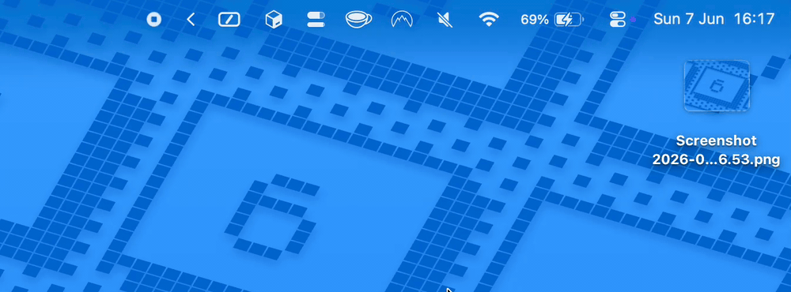

# Slashgrab

<p align="center">
  
</p>


Slashgrab is a tiny macOS menu bar utility that turns dropped files and folders into copied path text.

Drop something on the menu bar icon, then paste the path wherever you need it.



## Why

I built Slashgrab because getting a file path was always more work than it should be.

When I needed to paste a path into an AI agent, a chat, a terminal command, a bug report, or a config file, I usually had to find the file in Finder, drag the folder into Terminal or use another copy-path flow, copy the result, then switch back to the app where I actually needed it.

Slashgrab removes that detour:

1. Drag a file or folder.
2. Drop it on the Slashgrab menu bar icon.
3. Paste the copied path.

No command palette, no temporary shelf, and no extra window to manage.

## Features

- **Menu bar drop target**: drop files or folders directly on the Slashgrab icon.
- **Finder Copy Path**: right-click selected files or folders in Finder and choose **Copy Path**.
- **Instant clipboard copy**: the formatted path is copied as soon as the drop succeeds.
- **Multiple path formats**:
  - Shell Escaped
  - Path
  - Quoted Path
  - File URL
  - Home-relative Path
- **Multi-item support**: drop more than one item and Slashgrab formats the full set for the selected output style.
- **Recent paths**: reopen the menu to copy recently grabbed paths again.
- **Drop feedback**: quick visual confirmation when a path was copied.
- **Launch at login**: keep Slashgrab ready without starting it manually.
- **Sparkle updates**: release builds include update checking support.

## How It Works

Slashgrab lives in the macOS menu bar. Click the icon to change the output format, copy recent paths again, open Settings, or quit. Launch-at-login, Finder integration, updates, and app information live in the Settings window.

The bundled Finder extension adds **Copy Path** to Finder's contextual menu. It uses the same **Copy As** format selected in Slashgrab, including its multi-item separator. macOS requires Finder extensions to be enabled by the user: open Slashgrab's menu, choose **Settings…**, then open the Finder Extension settings from the General tab and enable Slashgrab.

The default workflow is intentionally small:

```text
Drop file -> copy path -> paste path
```

That makes it useful for developers, designers, QA, support, and anyone else who repeatedly sends local file references to terminals, scripts, docs, chats, or AI tools.

## Get Slashgrab

- macOS 13 or newer
- Website: [slashgrab.app](https://slashgrab.app/)

Download the latest `Slashgrab.dmg` directly from [GitHub Releases](https://github.com/prof18/slashgrab/releases/latest/download/Slashgrab.dmg).

The zip asset is used for Sparkle automatic updates.

## Build Locally

Local builds are meant for development and testing. They create a separate `Slashgrab Dev.app`, so you can run it without sharing settings or history with the eventual production app.

Requirements:

- macOS 13 or newer
- Xcode 26 or newer
- [XcodeGen](https://github.com/yonaskolb/XcodeGen) 2.46 or newer (`brew install xcodegen`)
- An Apple Development signing identity for running the Finder extension

`project.yml` is the source of truth for the Xcode project. Generate it manually with:

```bash
./Scripts/generate_project.sh
```

Build and verify the side-by-side dev app:

```bash
./Scripts/build_and_run.sh --verify --test
```

Run it locally:

```bash
./Scripts/build_and_run.sh
```

The dev build packages as `Slashgrab Dev.app` with bundle identifier `com.prof18.slashgrab.dev`, separate settings/history, Sparkle disabled, a `DEV` menu bar label, and a dev-badged app icon. When launched, the script signs it with an Apple Development identity, installs it to `~/Applications`, registers the Finder extension from that stable location, and opens the installed copy. Set `DEV_APP_IDENTITY` or `DEV_INSTALL_DIR` in `.env` to override those defaults.

Run the full SwiftPM and Xcode test suite with:

```bash
./Scripts/test.sh
```

## Development Gate

Run the local CI gate:

```bash
./ci.sh
```

## License

Copyright 2026 Marco Gomiero.

Slashgrab is licensed under the Apache License, Version 2.0. See [LICENSE](LICENSE) for the full license text.
