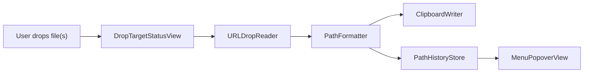

# Technical Architecture

## Recommended Stack

- Language: Swift.
- Platform: macOS.
- Minimum OS: macOS 13+.
- Project model: SwiftPM-first app bundle, unless implementation discovers a strong reason to switch to an Xcode project.
- Development approach: TDD across core logic and platform behavior.
- Core platform layer: AppKit.
- Visible UI: SwiftUI where practical.
- Persistence: `UserDefaults` or lightweight JSON for recent history and settings.
- App lifecycle: menu-bar-only accessory app.
- Launch at login: `SMAppService` if compatible with the final project shape.
- Automatic updates: Sparkle 2, matching Shellporter's direct-distribution setup.

## Bundle Identifiers

Production:

- `com.prof18.slashgrab`

Development:

- `com.prof18.slashgrab.dev`

The dev build should be a separate app identity so it can run alongside the notarized production build. It should also use separate settings/history storage to avoid contaminating production preferences during testing.

Recommended dev differences:

- App name: `Slashgrab Dev`
- Bundle identifier: `com.prof18.slashgrab.dev`
- Menu bar icon variant or debug indicator.
- Separate `UserDefaults` suite if shared code would otherwise collide.

## Signing and App IDs

Use `asc` CLI when app identifiers or signing assets are needed.

Planned identifiers:

- Production App ID / bundle ID: `com.prof18.slashgrab`
- Development App ID / bundle ID: `com.prof18.slashgrab.dev`

Assumption:

- Certificates likely already exist.
- If certificates, App IDs, or profiles are missing, create or inspect them with `asc` rather than doing manual portal work.

## Updates

Use Sparkle 2 for automatic updates.

Expected pieces:

- SwiftPM dependency: `https://github.com/sparkle-project/Sparkle`
- `SPUStandardUpdaterController`
- `SUFeedURL` in `Info.plist`
- `SUPublicEDKey` in `Info.plist`
- `SUEnableAutomaticChecks` enabled
- Menu/popover action: `Check for Updates`

Dev builds should either use a dev appcast feed or disable production update checks to avoid dev builds updating into production unexpectedly.

## Local Build/Run

Use the macOS build-run skill contract:

- Create `script/build_and_run.sh` as the primary local kill/build/run entrypoint.
- Stage a project-local `.app` bundle before launch; do not launch a SwiftPM GUI executable directly.
- Support `--debug`, `--logs`, `--telemetry`, and `--verify` where practical.
- Add `.codex/environments/environment.toml` with a `Run` action pointing to `./script/build_and_run.sh`.

Keep Shellporter-style release scripts under `Scripts/`, but do not let release packaging scripts replace the local Codex run entrypoint.

## Why Hybrid AppKit + SwiftUI

SwiftUI `MenuBarExtra` is good for a menu bar popover, settings, and simple UI.

The hard requirement is dropping directly on the menu bar icon. That is an AppKit edge:

- `NSStatusBar.system.statusItem(withLength:)`
- custom `NSView`
- `registerForDraggedTypes`
- `NSDraggingDestination`
- `NSPasteboard.PasteboardType.fileURL`

Smallest bridge:

- AppKit owns the status item and drop target view.
- SwiftUI owns the popover/settings UI.
- Shared app state is held in one app-level store.
- AppKit calls a narrow `handleDroppedURLs(_:)` service.

## Proposed Modules

- `App/SlashgrabApp.swift`
- `App/AppDelegate.swift`
- `StatusItem/StatusItemController.swift`
- `StatusItem/DropTargetStatusView.swift`
- `Services/ClipboardWriter.swift`
- `Services/PathFormatter.swift`
- `Stores/PathHistoryStore.swift`
- `Models/PathFormat.swift`
- `Views/MenuPopoverView.swift`
- `Views/RecentPathRow.swift`
- `Views/SettingsView.swift`
- `Support/URLDropReader.swift`

## Test-First Boundaries

Write tests before production code for:

- `PathFormat`
- `PathFormatter`
- `PathHistoryStore`
- settings/defaults persistence
- duplicate history behavior
- multiple URL joining
- shell escaping edge cases
- file URL formatting
- `URLDropReader` with pasteboard fixtures where practical
- `ClipboardWriter` via an injectable pasteboard abstraction

Use acceptance checks before implementation for:

- menu bar drop target behavior
- popover interaction
- launch-at-login toggle
- Sparkle update check wiring
- signing/notarization packaging

## Data Flow

## Permissions

Core drop workflow:

- No Full Disk Access.
- No Finder automation permission.
- No security-scoped bookmarks needed for immediate path extraction/copying.
- No default notification permission request.
- Direct notarized distribution first; keep sandbox compatibility if low cost, but do not let App Store constraints drive the MVP.

Only add permissions if we later implement:

- Copy current Finder selection.
- Long-term file access after relaunch.
- Script execution or file reading beyond path display.

## Path Formatting Rules

Centralize formatting in `PathFormatter`.

Default formatter:

- Shell escaped path output intended for Terminal usage.
- Single file example: `/Users/mg/Desktop/Test\ File.txt`
- Multiple file example: `/Users/mg/Desktop/A.txt /Users/mg/Desktop/Test\ File.txt`

Rules to test:

- Spaces.
- Quotes.
- Backslashes.
- Newlines in filenames.
- Unicode.
- Tilde replacement.
- File URL encoding.
- Multiple dropped URLs as terminal arguments.

## Persistence

Store:

- selected path format
- recent copied outputs
- history size
- optional launch-at-login setting

Avoid storing:

- file contents
- security-scoped bookmarks
- absolute file metadata beyond copied path text

For dev/prod side-by-side support, key persistence by bundle identifier or an explicit app environment so dev and production histories stay separate.

History behavior:

- Keep 10 recent copied outputs.
- Move duplicate output to the top instead of storing repeated entries.
- Persist copied path text across relaunch.

## Risks

- Direct menu bar icon drop target is small; feedback needs to be obvious.
- `NSStatusItem.view` can override normal status item behavior; ensure click/menu behavior still works.
- Multi-file pasteboard ordering may vary.
- Sandboxed distribution may behave differently from local debug builds; test early.
- SwiftPM GUI apps need an app bundle for realistic launch behavior; raw executable launches can hide bundle/signing/update issues.
